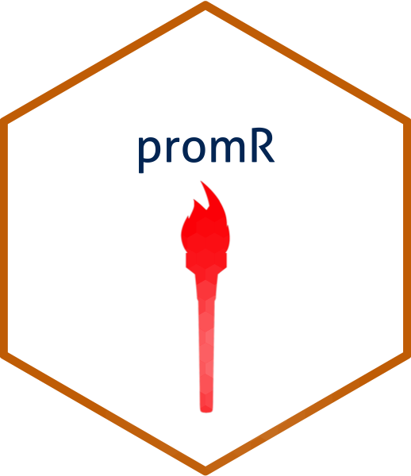

<!-- README.md is generated from README.Rmd. Please edit that file -->
# promR 

[](https://travis-ci.org/glenn-m/promR) 
[](https://codecov.io/github/glenn-m/promR?branch=master) [](https://www.tidyverse.org/lifecycle/#experimental)

R library for reading and analysing metrics stored on a [Prometheus](https://prometheus.io/) server.

## Installation

You can install `promR` using [`devtools`](https://github.com/r-lib/devtools):

```{r, echo = TRUE, eval = FALSE}
if (requireNamespace("devtools", quietly = TRUE)) {
    devtools::install_github('glenn-m/promR')
} else {
    install.packages("devtools")
    devtools::install_github('glenn-m/promR')
}
```

## Usage

### Instant Query

To retrieve the value of the `go_goroutines` metric 60 seconds ago.

```{r current_time_example, echo = TRUE}
library(promR)
prom <- Prometheus$new(host = "http://demo.robustperception.io", port = 9090)
# Timestamps can be in rfc3339 or unix format
metrics_instant <- prom$query(query = "go_goroutines", time = as.POSIXct(Sys.time() - 60))
```
**Output:**
```{r current_time_results, echo = FALSE, results = 'asis'}
knitr::kable(head(metrics_instant))
```

### Range Query

```{r range_query_example, echo = TRUE}
library(promR)
prom <- Prometheus$new(host = "http://demo.robustperception.io", port = 9090)
metrics_range <- prom$rangeQuery(
  query = "go_goroutines",
  start = as.numeric(as.POSIXct(Sys.time() - 600)),
  end = as.numeric(as.POSIXct(Sys.time())),
  step = "10s"
)
```
**Output:**
```{r range_results, echo = FALSE, results = 'asis'}
knitr::kable(head(metrics_range))
```

### Metadata Query

#### Get metadata for all node exporter metrics.

```{r metadata_query_example, echo = TRUE}
library(promR)
prom <- Prometheus$new(host = "http://demo.robustperception.io", port = 9090)
metrics_metadata <- prom$metadataQuery(match_target = '{job="node"}')
```
**Output:**
```{r metadata_results, echo = FALSE, results = 'asis'}
knitr::kable(head(metrics_metadata))
```

### Get metadata for all metrics.

```{r metadata_query_example2, echo = TRUE}
library(promR)
prom <- Prometheus$new(host = "http://demo.robustperception.io", port = 9090)
metrics_metadata <- prom$metadataQuery(match_target = '{job=~".+"}')
```
**Output:**
```{r metadata_results2, echo = FALSE, results = 'asis'}
knitr::kable(head(metrics_metadata))
```

## Contributing

1.  Fork it ( https://github.com/glenn-m/promR/fork )
2.  Create your feature branch (git checkout -b my-new-feature)
3.  Make your changes
4.  Run `devtools::test()` to ensure tests are passing.
5.  Commit your changes (git commit -am 'Add some feature')
6.  Push to the branch (git push origin my-new-feature)
7.  Create a new Pull Request

## Contributors

- [Glenn McDonald](https://github.com/glenn-m)
- [Konrad Zdeb](https://github.com/konradedgar)
- [Tyler Littlefield](https://github.com/tyluRp)
